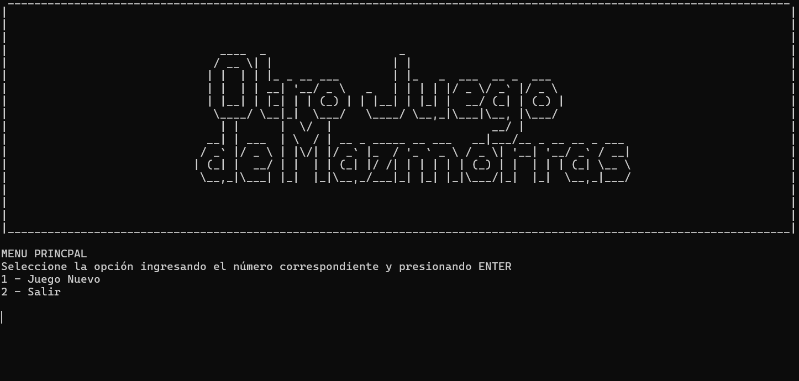

# Trabajo Práctico 1 – Aventura Conversacional


## Integrantes
- Caro, Nicolás  
- Lazza, Camila  
- Mazzolo, Nazareno  
- Porcel, Nicolás  

## Descripción
**"Otro Juego de Mazmorras"** es una aventura de texto por consola escrita en C++, donde asumís el rol de un aventurero que se adentra en una mazmorra para enfrentar criaturas y proteger a su aldea. A lo largo del juego, deberás usar los objetos de tu inventario de forma creativa, escribiendo verbos asociados a cada objeto para interactuar con los enemigos y el entorno.

## Cómo jugar
- Comenzás con **10 vidas** y un inventario que incluye objetos como una daga, un hacha, un libro, entre otros.
- Cada objeto puede usarse una única vez; si lo usás correctamente, progresás en la historia.
- Usar un objeto en el momento equivocado puede hacerte perderlo o quitarte una vida.
- Si tus vidas llegan a **cero**, el juego termina.
- Según qué objetos uses y cuándo lo hagas, se pueden obtener diferentes desenlaces.

## Compilar y ejecutar
Solo se necesita un compilador de C++ moderno (g++ o clang) en un entorno tipo Unix para ejecutar este juego desde la terminal. Para una mejor experiencia, la terminal se debe configurar a un tamaño de 120x40 caracteres.

Ejemplo:

```bash
g++ -o main main.cpp
./main
```
